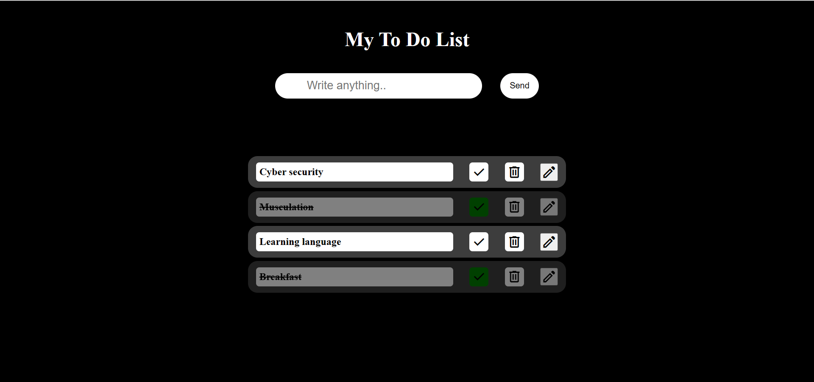

# MY_To_Do_List
<<<<<<< HEAD
=======
<h2>My first project using JS..</h2>
 
<h3>With MY_To_Do_List you can record your diary or take your notes</h3>
 
<h2>user's tasks :</h2>
<ul>
  <li>Edit tasks</li>
  <li>Remove tasks</li>
  <li>Doing tasks</li>
</ul>
<h2>Note :</h2>
all tasks you make are stored in local storage
<h1>UI interface :</h1>

>>>>>>> e549befdf4884e0d91bb0e7c46a12487a8b6b4f5
